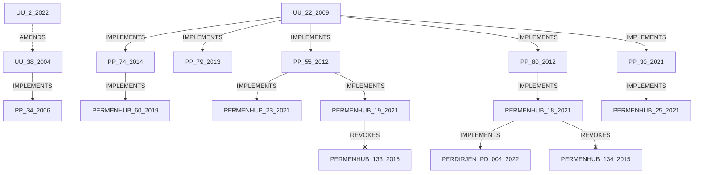

# 🚛 VETO — Indonesian Road Freight Regulatory Corpus

> **ODOL (Over Dimension Over Loading) Compliance & Dispatch Validation System**
> Generated: 11 August 2026, 16:50 WIB

---

## 📊 Ringkasan Statistik

| Metrik | Nilai | Keterangan |
|--------|-------|------------|
| 📋 Total Regulasi | **29** | UU, PP, Permenhub, SE, Perdirjen, Lokal |
| ✅ Berlaku (Aktif) | **18** | Dapat diterapkan langsung |
| 🚫 Dicabut | **3** | Referensi historis |
| 🔄 Diubah | **3** | Berlaku dengan perubahan |
| ❓ Status Unknown | **5** | Perlu verifikasi |
| 📖 Pasal Diekstrak | **16** | Dengan teks asli + normalisasi |
| ⚙️ Aturan Mesin | **13** | Machine-readable conditional rules |
| 🔢 Threshold Numerik | **18** | Dimensi, MST, JBI, Sanksi |
| ⚖️ Sanksi | **5** | Pidana & Administratif |
| 🗺️ Regulasi Daerah | **13** | Provinsi & kota |
| 🔗 Relationships | **19** | IMPLEMENTS / AMENDS / REVOKES |
| ⚠️ Butuh Verifikasi | **10** | Nilai perlu konfirmasi dari PDF resmi |
| ⚡ Konflik | **3** | 1 unresolved — perlu legal review |

> [!CAUTION]
> **Toleransi 5% dalam PM 18/2021** adalah toleransi teknis alat ukur di jembatan timbang,
> **BUKAN** tambahan allowance hukum di atas JBI. VETO **HARUS** menggunakan JBI sebagai
> batas keras (*hard limit*). Nilai `verification_required: true` wajib dikonfirmasi dari PDF resmi.

---

## 📋 Daftar Isi

1. [Corpus Regulasi Lengkap (29)](#1-corpus-regulasi-lengkap-29)
   *UU, PP, Permenhub, SE, Perdirjen, Lokal*
2. [Top 10 Regulasi Prioritas VETO](#2-top-10-regulasi-prioritas-veto)
   *Regulasi paling kritis untuk engine validasi*
3. [Pasal-Pasal Kunci (16 Pasal)](#3-pasal-pasal-kunci-16-pasal)
   *Teks asli & aturan ternormalisasi*
4. [Aturan Mesin — Machine-Readable Rules](#4-aturan-mesin-machine-readable-rules)
   *13 conditional rules siap pakai*
5. [Threshold Numerik (18 Nilai)](#5-threshold-numerik-18-nilai)
   *Semua batas angka: dimensi, MST, JBI, sanksi*
6. [Aturan Kendaraan per Konfigurasi Sumbu](#6-aturan-kendaraan-per-konfigurasi-sumbu)
   *JBI/MST per axle config*
7. [Matriks Kelas Jalan](#7-matriks-kelas-jalan)
   *Batas dimensi & MST per kelas jalan*
8. [Sanksi & Pelanggaran](#8-sanksi-pelanggaran)
   *Pidana dan administratif*
9. [Regulasi Daerah (13 Daerah)](#9-regulasi-daerah-13-daerah)
   *13 daerah: provinsi & kota*
10. [Graf Relasi Regulasi](#10-graf-relasi-regulasi)
   *IMPLEMENTS / AMENDS / REVOKES*
11. [Konflik Regulasi & Resolusi](#11-konflik-regulasi-resolusi)
   *3 konflik terdeteksi*
12. [Sumber Resmi](#12-sumber-resmi)
   *7 portal JDIH resmi*
13. [Gaps & Missing Regulations](#13-gaps-missing-regulations)
   *10 gap kritis*

---

## 1. Corpus Regulasi Lengkap (29)

### Undang-Undang (UU)

| # | ID | Nomor/Tahun | Judul | Status | Subjek |
|---|----|-------------|-------|--------|--------|
| 1 | `UU_22_2009` | **UU 22 / 2009** | [Lalu Lintas dan Angkutan Jalan](https://peraturan.bpk.go.id/Details/38946/uu-no-22-tahun-2009) | ✅ BERLAKU | LLAJ, angkutan jalan, kendaraan bermotor |
| 2 | `UU_38_2004` | **UU 38 / 2004** | [Jalan](https://peraturan.bpk.go.id/Details/40712/uu-no-38-tahun-2004) | 🔄 DIUBAH | jalan, kelas jalan, daya dukung jalan |
| 3 | `UU_2_2022` | **UU 2 / 2022** | [Perubahan Kedua atas Undang-Undang Nomor 38 Tahun 2004 ](https://peraturan.bpk.go.id/Details/227605/uu-no-2-tahun-2022) | ✅ BERLAKU | jalan, kelas jalan, daya dukung jalan |

> **UU_22_2009** ✅ — UU induk LLAJ. Pasal 19–22 kelas jalan+MST, Pasal 169 larangan muatan lebih, Pasal 307 sanksi.
> **UU_38_2004** 🔄 — UU Jalan. Mendefinisikan kelas jalan dan daya dukung. Diubah oleh UU 2/2022.
> **UU_2_2022** ✅ — Perubahan kedua UU Jalan. Status UU 38/2004: DIUBAH.

### Peraturan Pemerintah (PP)

| # | ID | Nomor/Tahun | Judul | Status | Subjek |
|---|----|-------------|-------|--------|--------|
| 1 | `PP_55_2012` | **PP 55 / 2012** | [Kendaraan](https://peraturan.bpk.go.id/Details/5307/pp-no-55-tahun-2012) | ✅ BERLAKU | kendaraan bermotor, persyaratan teknis, dimensi kendaraan |
| 2 | `PP_74_2014` | **PP 74 / 2014** | [Angkutan Jalan](https://peraturan.bpk.go.id/Details/41098/pp-no-74-tahun-2014) | ✅ BERLAKU | angkutan jalan, angkutan barang, mobil barang |
| 3 | `PP_79_2013` | **PP 79 / 2013** | [Jaringan Lalu Lintas dan Angkutan Jalan](https://peraturan.bpk.go.id/Details/38736/pp-no-79-tahun-2013) | ✅ BERLAKU | jaringan jalan, kelas jalan, daya dukung jalan |
| 4 | `PP_80_2012` | **PP 80 / 2012** | [Tata Cara Pemeriksaan Kendaraan Bermotor di Jalan dan P](https://peraturan.bpk.go.id/Details/5308/pp-no-80-tahun-2012) | ✅ BERLAKU | pemeriksaan kendaraan, penindakan, jembatan timbang |
| 5 | `PP_30_2021` | **PP 30 / 2021** | [Penyelenggaraan Bidang Lalu Lintas dan Angkutan Jalan](https://peraturan.bpk.go.id/Details/162840/pp-no-30-tahun-2021) | ✅ BERLAKU | penyelenggaraan LLAJ, standar pelayanan, perizinan |
| 6 | `PP_34_2006` | **PP 34 / 2006** | [Jalan](https://peraturan.bpk.go.id/Details/65066/pp-no-34-tahun-2006) | ✅ BERLAKU | kelas jalan, MST jalan, daya dukung jalan |
| 7 | `PP_15_2005` | **PP 15 / 2005** | [Jalan Tol](https://peraturan.bpk.go.id/Details/64989/pp-no-15-tahun-2005) | 🔄 DIUBAH | jalan tol, kendaraan tol, pembatasan kendaraan tol |

> **PP_55_2012** ✅ — PP utama kendaraan bermotor. KRITIS — mendefinisikan JBI/MST/dimensi, lampiran berisi tabel JBI per konfigurasi sumbu.
> **PP_74_2014** ✅ — PP angkutan jalan. Perizinan dan ketentuan operasional angkutan barang.
> **PP_79_2013** ✅ — Jaringan jalan nasional dan kapasitas daya dukung.
> **PP_80_2012** ✅ — Pemeriksaan kendaraan di jalan dan penindakan muatan lebih. Dasar hukum jembatan timbang.
> **PP_30_2021** ✅ — PP terbaru penyelenggaraan LLAJ.
> **PP_34_2006** ✅ — Mendefinisikan kelas jalan I/II/III dan MST diizinkan per kelas. KRITIS untuk validasi rute.
> **PP_15_2005** 🔄 — Kendaraan yang boleh masuk jalan tol, termasuk batas dimensi dan berat.

### Peraturan Menteri Perhubungan (Permenhub)

| # | ID | Nomor/Tahun | Judul | Status | Subjek |
|---|----|-------------|-------|--------|--------|
| 1 | `PERMENHUB_60_2019` | **PERMENHUB 60 / 2019** | [Penyelenggaraan Angkutan Barang dengan Kendaraan Bermot](https://jdih.kemenhub.go.id/regulasi/view/pm/60/2019) | ✅ BERLAKU | angkutan barang, mobil barang, daya angkut |
| 2 | `PERMENHUB_18_2021` | **PERMENHUB 18 / 2021** | [Pengawasan Muatan Angkutan Barang dan Penyelenggaraan P](https://jdih.kemenhub.go.id/regulasi/view/pm/18/2021) | ✅ BERLAKU | pengawasan muatan, penimbangan, jembatan timbang |
| 3 | `PERMENHUB_19_2021` | **PERMENHUB 19 / 2021** | [Pengujian Berkala Kendaraan Bermotor](https://jdih.kemenhub.go.id/regulasi/view/pm/19/2021) | ✅ BERLAKU | uji berkala, pengujian kendaraan, laik jalan |
| 4 | `PERMENHUB_23_2021` | **PERMENHUB 23 / 2021** | [Pengujian Tipe Kendaraan Bermotor](https://jdih.kemenhub.go.id/regulasi/view/pm/23/2021) | ✅ BERLAKU | uji tipe, rancang bangun, modifikasi kendaraan |
| 5 | `PERMENHUB_25_2021` | **PERMENHUB 25 / 2021** | [Penyelenggaraan Bidang Angkutan Jalan](https://jdih.kemenhub.go.id/regulasi/view/pm/25/2021) | ✅ BERLAKU | angkutan jalan, perizinan angkutan, angkutan barang |
| 6 | `PERMENHUB_47_2021` | **PERMENHUB 47 / 2021** | [Alat Penimbangan Kendaraan Bermotor yang dapat Bergerak](https://jdih.kemenhub.go.id/regulasi/view/pm/47/2021) | ✅ BERLAKU | alat penimbangan, mobile weighing, penimbangan bergerak ⚠️ |
| 7 | `PERMENHUB_134_2015` | **PERMENHUB 134 / 2015** | [Penyelenggaraan Penimbangan Kendaraan Bermotor di Jalan](https://jdih.kemenhub.go.id/regulasi/view/pm/134/2015) | 🚫 DICABUT | penimbangan, jembatan timbang, muatan lebih |
| 8 | `PERMENHUB_133_2015` | **PERMENHUB 133 / 2015** | Pengujian Berkala Kendaraan Bermotor | 🚫 DICABUT | uji berkala, pengujian kendaraan |
| 9 | `PERMENHUB_33_2018` | **PERMENHUB 33 / 2018** | Pengujian Tipe Kendaraan Bermotor | 🚫 DICABUT | uji tipe, rancang bangun |
| 10 | `PERMENHUB_1_2015` | **PERMENHUB 1 / 2015** | [Angkutan Barang Berbahaya](https://jdih.kemenhub.go.id/) | ❓ UNKNOWN | barang berbahaya, angkutan khusus, B3 ⚠️ |
| 11 | `PERMENHUB_2024_ODOL` | **PERMENHUB UNKNOWN / 2024** | [Permenhub terkait ODOL / Zero ODOL 2027 (2024)](https://jdih.kemenhub.go.id/) | ❓ UNKNOWN | ODOL, Zero ODOL 2027, normalisasi kendaraan ⚠️ |

> **PERMENHUB_60_2019** ✅ — Permenhub utama angkutan barang. Tata cara operasional, persyaratan kendaraan, daya angkut, rute. KRITIS.
> **PERMENHUB_18_2021** ✅ — KRITIS. MST per kelas jalan, prosedur penimbangan, WIM, toleransi 5%, penindakan (normalisasi).
> **PERMENHUB_19_2021** ✅ — Uji berkala kendaraan bermotor termasuk mobil barang — interval 6 bulan.
> **PERMENHUB_23_2021** ✅ — Uji tipe dan modifikasi. Perubahan dimensi/berat memerlukan sertifikat uji tipe baru.
> **PERMENHUB_25_2021** ✅ — Penyelenggaraan angkutan jalan termasuk perizinan angkutan barang.
> **PERMENHUB_47_2021** ✅ — Alat penimbangan bergerak (mobile weighing unit) untuk pengawasan muatan di lapangan.
> **PERMENHUB_134_2015** 🚫 — Dicabut oleh PM 18/2021.
> **PERMENHUB_133_2015** 🚫 — Dicabut oleh PM 19/2021.
> **PERMENHUB_33_2018** 🚫 — Dicabut oleh PM 23/2021.
> **PERMENHUB_1_2015** ❓ — Angkutan barang berbahaya. Status terkini perlu verifikasi.
> **PERMENHUB_2024_ODOL** ❓ — Regulasi 2024 terkait Zero ODOL. Nomor spesifik perlu dikonfirmasi dari JDIH.

### Surat Edaran Menteri Perhubungan

| # | ID | Nomor/Tahun | Judul | Status | Subjek |
|---|----|-------------|-------|--------|--------|
| 1 | `SE_MENHUB_21_2019` | **SE_MENHUB 21 / 2019** | [Pengawasan Terhadap Mobil Barang atas Pelanggaran Muata](https://jdih.kemenhub.go.id/regulasi/view/se/21/2019) | ✅ BERLAKU | muatan lebih, ukuran lebih, ODOL |

> **SE_MENHUB_21_2019** ✅ — Surat edaran khusus ODOL. Dasar operasional program Zero ODOL.

### Surat Edaran Direktur Jenderal

| # | ID | Nomor/Tahun | Judul | Status | Subjek |
|---|----|-------------|-------|--------|--------|
| 1 | `SE_DJPD_2023_ODOL` | **SE_DIRJEN UNKNOWN / 2023** | [Surat Edaran Dirjen Perhubungan Darat tentang ODOL / No](https://jdih.kemenhub.go.id/) | ❓ UNKNOWN | ODOL, normalisasi kendaraan, zero ODOL ⚠️ |

> **SE_DJPD_2023_ODOL** ❓ — Nomor perlu dikonfirmasi dari JDIH Kemenhub.

### Peraturan Direktur Jenderal

| # | ID | Nomor/Tahun | Judul | Status | Subjek |
|---|----|-------------|-------|--------|--------|
| 1 | `PERDIRJEN_PD_004_2022` | **PERDIRJEN SK.4234/AJ.309/DRJD/2022 / 2022** | [Petunjuk Teknis Penyelenggaraan Penimbangan Kendaraan B](https://jdih.kemenhub.go.id/) | ✅ BERLAKU | WIM, weigh in motion, penimbangan bergerak ⚠️ |

> **PERDIRJEN_PD_004_2022** ✅ — Petunjuk teknis WIM. Nomor surat perlu verifikasi.

### Keputusan Menteri Perhubungan

| # | ID | Nomor/Tahun | Judul | Status | Subjek |
|---|----|-------------|-------|--------|--------|
| 1 | `KEPMENHUB_52_2004` | **KEPMENHUB KM_52 / 2004** | Penyelenggaraan Angkutan Barang Berbahaya | ❓ UNKNOWN | barang berbahaya, B3, angkutan khusus ⚠️ |

> **KEPMENHUB_52_2004** ❓ — Status terkini perlu verifikasi — mungkin sudah digantikan.

### Instruksi Presiden

| # | ID | Nomor/Tahun | Judul | Status | Subjek |
|---|----|-------------|-------|--------|--------|
| 1 | `INPRES_ODOL_2024` | **INPRES UNKNOWN / 2024** | [Instruksi Presiden terkait Program ODOL / Kendaraan Tua](https://peraturan.go.id/) | ❓ UNKNOWN | kendaraan tua, ODOL, normalisasi ⚠️ |

> **INPRES_ODOL_2024** ❓ — Perlu verifikasi nomor dan status.

### Peraturan Gubernur

| # | ID | Nomor/Tahun | Judul | Status | Subjek |
|---|----|-------------|-------|--------|--------|
| 1 | `PERGUB_DKI_117_2017` | **PERGUB 117 / 2017** | [Pembatasan Lalu Lintas Kendaraan Angkutan Barang di DKI](https://jdih.jakarta.go.id/) | 🔄 DIUBAH | pembatasan kendaraan, angkutan barang, DKI Jakarta ⚠️ |
| 2 | `PERGUB_DKI_83_2020` | **PERGUB 83 / 2020** | [Perubahan Pergub 117/2017 tentang Pembatasan Lalu Linta](https://jdih.jakarta.go.id/) | ✅ BERLAKU | pembatasan kendaraan, angkutan barang, DKI Jakarta ⚠️ |

> **PERGUB_DKI_117_2017** 🔄 — Pembatasan jam operasional truk besar di Jakarta.
> **PERGUB_DKI_83_2020** ✅ — Perubahan pergub pembatasan angkutan barang DKI.

### Peraturan Daerah

| # | ID | Nomor/Tahun | Judul | Status | Subjek |
|---|----|-------------|-------|--------|--------|
| 1 | `PERDA_DKI_5_2014` | **PERDA 5 / 2014** | [Transportasi](https://jdih.jakarta.go.id/) | ✅ BERLAKU | transportasi, angkutan jalan, DKI Jakarta ⚠️ |

> **PERDA_DKI_5_2014** ✅ — Perda transportasi DKI Jakarta.

---

## 2. Top 10 Regulasi Prioritas VETO

> [!IMPORTANT]
> Regulasi berikut adalah core knowledge base untuk VETO Validation Engine.
> Semua aturan validasi dispatch harus merujuk ke regulasi-regulasi ini.

### 1. 🔴 `UU_22_2009` — [KRITIS]

| Field | Detail |
|-------|--------|
| **Regulasi** | **UU No. 22 Tahun 2009** |
| **Judul** | Lalu Lintas dan Angkutan Jalan |
| **Status** | ✅ BERLAKU |
| **Prioritas** | 🔴 KRITIS |
| **Pasal Diekstrak** | 6 artikel |
| **Relevansi VETO** | Pasal 19-22: kelas jalan + MST. Pasal 169: larangan muatan lebih. Pasal 307: denda ≤Rp500.000 / kurungan ≤2 bulan. |
| **URL Resmi** | [https://peraturan.bpk.go.id/Details/38946/uu-no-22-tahun-2009](https://peraturan.bpk.go.id/Details/38946/uu-no-22-tahun-2009) |

### 2. 🔴 `PP_55_2012` — [KRITIS]

| Field | Detail |
|-------|--------|
| **Regulasi** | **PP No. 55 Tahun 2012** |
| **Judul** | Kendaraan |
| **Status** | ✅ BERLAKU |
| **Prioritas** | 🔴 KRITIS |
| **Pasal Diekstrak** | 4 artikel |
| **Relevansi VETO** | Dimensi maks (lebar 2.500mm, tinggi 4.200mm, panjang 12.000/18.000mm). Lampiran: tabel JBI per konfigurasi sumbu — wajib diverifikasi. |
| **URL Resmi** | [https://peraturan.bpk.go.id/Details/5307/pp-no-55-tahun-2012](https://peraturan.bpk.go.id/Details/5307/pp-no-55-tahun-2012) |

### 3. 🔴 `PERMENHUB_18_2021` — [KRITIS]

| Field | Detail |
|-------|--------|
| **Regulasi** | **PERMENHUB No. 18 Tahun 2021** |
| **Judul** | Pengawasan Muatan Angkutan Barang dan Penyelenggaraan Penimbangan Kendaraan Bermotor di Jalan |
| **Status** | ✅ BERLAKU |
| **Prioritas** | 🔴 KRITIS |
| **Pasal Diekstrak** | 5 artikel |
| **Relevansi VETO** | MST per kelas jalan (I:10t, II/III:8t). WIM framework. Normalisasi overloaded. Toleransi 5% = teknis, bukan legal. |
| **URL Resmi** | [https://jdih.kemenhub.go.id/regulasi/view/pm/18/2021](https://jdih.kemenhub.go.id/regulasi/view/pm/18/2021) |

### 4. 🔴 `PERMENHUB_60_2019` — [KRITIS]

| Field | Detail |
|-------|--------|
| **Regulasi** | **PERMENHUB No. 60 Tahun 2019** |
| **Judul** | Penyelenggaraan Angkutan Barang dengan Kendaraan Bermotor di Jalan |
| **Status** | ✅ BERLAKU |
| **Prioritas** | 🔴 KRITIS |
| **Pasal Diekstrak** | 0 artikel |
| **Relevansi VETO** | Tata cara operasional angkutan barang, perizinan, daya angkut, rute. Core permenhub untuk dispatch. |
| **URL Resmi** | [https://jdih.kemenhub.go.id/regulasi/view/pm/60/2019](https://jdih.kemenhub.go.id/regulasi/view/pm/60/2019) |

### 5. 🟠 `PP_74_2014` — [TINGGI]

| Field | Detail |
|-------|--------|
| **Regulasi** | **PP No. 74 Tahun 2014** |
| **Judul** | Angkutan Jalan |
| **Status** | ✅ BERLAKU |
| **Prioritas** | 🟠 TINGGI |
| **Pasal Diekstrak** | 0 artikel |
| **Relevansi VETO** | PP Angkutan Jalan. Perizinan dan ketentuan operasional — dasar hukum PM 60/2019. |
| **URL Resmi** | [https://peraturan.bpk.go.id/Details/41098/pp-no-74-tahun-2014](https://peraturan.bpk.go.id/Details/41098/pp-no-74-tahun-2014) |

### 6. 🟠 `PP_34_2006` — [TINGGI]

| Field | Detail |
|-------|--------|
| **Regulasi** | **PP No. 34 Tahun 2006** |
| **Judul** | Jalan |
| **Status** | ✅ BERLAKU |
| **Prioritas** | 🟠 TINGGI |
| **Pasal Diekstrak** | 0 artikel |
| **Relevansi VETO** | Kelas jalan I/II/III dan MST yang diizinkan. Wajib untuk validasi rute kendaraan. |
| **URL Resmi** | [https://peraturan.bpk.go.id/Details/65066/pp-no-34-tahun-2006](https://peraturan.bpk.go.id/Details/65066/pp-no-34-tahun-2006) |

### 7. 🟠 `PERMENHUB_19_2021` — [TINGGI]

| Field | Detail |
|-------|--------|
| **Regulasi** | **PERMENHUB No. 19 Tahun 2021** |
| **Judul** | Pengujian Berkala Kendaraan Bermotor |
| **Status** | ✅ BERLAKU |
| **Prioritas** | 🟠 TINGGI |
| **Pasal Diekstrak** | 1 artikel |
| **Relevansi VETO** | Uji berkala wajib tiap 6 bulan. Tanpa sertifikat valid = tidak laik jalan = HOLD. |
| **URL Resmi** | [https://jdih.kemenhub.go.id/regulasi/view/pm/19/2021](https://jdih.kemenhub.go.id/regulasi/view/pm/19/2021) |

### 8. 🟠 `PERMENHUB_23_2021` — [TINGGI]

| Field | Detail |
|-------|--------|
| **Regulasi** | **PERMENHUB No. 23 Tahun 2021** |
| **Judul** | Pengujian Tipe Kendaraan Bermotor |
| **Status** | ✅ BERLAKU |
| **Prioritas** | 🟠 TINGGI |
| **Pasal Diekstrak** | 0 artikel |
| **Relevansi VETO** | Uji tipe & modifikasi. Perubahan dimensi/berat harus sertifikat uji tipe baru. |
| **URL Resmi** | [https://jdih.kemenhub.go.id/regulasi/view/pm/23/2021](https://jdih.kemenhub.go.id/regulasi/view/pm/23/2021) |

### 9. 🟠 `PP_80_2012` — [TINGGI]

| Field | Detail |
|-------|--------|
| **Regulasi** | **PP No. 80 Tahun 2012** |
| **Judul** | Tata Cara Pemeriksaan Kendaraan Bermotor di Jalan dan Penindakan Pelanggaran LLAJ |
| **Status** | ✅ BERLAKU |
| **Prioritas** | 🟠 TINGGI |
| **Pasal Diekstrak** | 0 artikel |
| **Relevansi VETO** | Tata cara pemeriksaan kendaraan di jalan & penindakan. Dasar hukum jembatan timbang. |
| **URL Resmi** | [https://peraturan.bpk.go.id/Details/5308/pp-no-80-tahun-2012](https://peraturan.bpk.go.id/Details/5308/pp-no-80-tahun-2012) |

### 10. 🟠 `SE_MENHUB_21_2019` — [TINGGI]

| Field | Detail |
|-------|--------|
| **Regulasi** | **SE_MENHUB No. 21 Tahun 2019** |
| **Judul** | Pengawasan Terhadap Mobil Barang atas Pelanggaran Muatan Lebih dan/atau Pelanggaran Ukuran Lebih |
| **Status** | ✅ BERLAKU |
| **Prioritas** | 🟠 TINGGI |
| **Pasal Diekstrak** | 0 artikel |
| **Relevansi VETO** | SE khusus ODOL. Dasar operasional pengawasan muatan lebih & ukuran lebih. |
| **URL Resmi** | [https://jdih.kemenhub.go.id/regulasi/view/se/21/2019](https://jdih.kemenhub.go.id/regulasi/view/se/21/2019) |

---

## 3. Pasal-Pasal Kunci (16 Pasal)

> Teks asli bahasa Indonesia + normalisasi menjadi aturan mesin.

### ✅ UU 22 — Pasal 19 ayat (1)

**Topik:** Kelas Jalan dan MST

> *"Jalan dibagi dalam beberapa kelas berdasarkan fungsi dan intensitas lalu lintas serta daya dukung untuk menerima muatan sumbu terberat dan dimensi kendaraan bermotor."*

**Aturan Ternormalisasi:**

```
Kelas jalan ditentukan berdasarkan daya dukung MST dan dimensi kendaraan yang diizinkan
```

🔗 Sumber: [https://peraturan.bpk.go.id/Details/38946/uu-no-22-tahun-2009](https://peraturan.bpk.go.id/Details/38946/uu-no-22-tahun-2009)

### ✅ UU 22 — Pasal 20 ayat (1)

**Topik:** Kelas Jalan I — Batas Dimensi dan MST

> *"Jalan kelas I adalah jalan arteri dan kolektor yang dapat dilalui kendaraan bermotor termasuk muatan dengan ukuran lebar tidak melebihi 2.500 milimeter, ukuran panjang tidak melebihi 18.000 milimeter, ukuran paling tinggi 4.200 milimeter, dan muatan sumbu terberat 10 ton."*

**Aturan Ternormalisasi:**

```
Kelas I: lebar ≤2.500 mm | panjang ≤18.000 mm | tinggi ≤4.200 mm | MST ≤10 ton
```

🔗 Sumber: [https://peraturan.bpk.go.id/Details/38946/uu-no-22-tahun-2009](https://peraturan.bpk.go.id/Details/38946/uu-no-22-tahun-2009)

### ✅ UU 22 — Pasal 21 ayat (1)

**Topik:** Kelas Jalan II — Batas Dimensi dan MST

> *"Jalan kelas II adalah jalan arteri, kolektor, lokal, dan lingkungan yang dapat dilalui kendaraan bermotor dengan ukuran lebar tidak melebihi 2.500 milimeter, ukuran panjang tidak melebihi 12.000 milimeter, ukuran paling tinggi 4.200 milimeter, dan muatan sumbu terberat 8 ton."*

**Aturan Ternormalisasi:**

```
Kelas II: lebar ≤2.500 mm | panjang ≤12.000 mm | tinggi ≤4.200 mm | MST ≤8 ton
```

🔗 Sumber: [https://peraturan.bpk.go.id/Details/38946/uu-no-22-tahun-2009](https://peraturan.bpk.go.id/Details/38946/uu-no-22-tahun-2009)

### ✅ UU 22 — Pasal 22 ayat (1)

**Topik:** Kelas Jalan III — Batas Dimensi dan MST

> *"Jalan kelas III adalah jalan arteri, kolektor, lokal, dan lingkungan yang dapat dilalui kendaraan bermotor dengan ukuran lebar tidak melebihi 2.100 milimeter, ukuran panjang tidak melebihi 9.000 milimeter, ukuran paling tinggi 3.500 milimeter, dan muatan sumbu terberat 8 ton."*

**Aturan Ternormalisasi:**

```
Kelas III: lebar ≤2.100 mm | panjang ≤9.000 mm | tinggi ≤3.500 mm | MST ≤8 ton
```

🔗 Sumber: [https://peraturan.bpk.go.id/Details/38946/uu-no-22-tahun-2009](https://peraturan.bpk.go.id/Details/38946/uu-no-22-tahun-2009)

### ✅ UU 22 — Pasal 169 ayat (1)

**Topik:** Larangan Melebihi JBI / Dimensi

> *"Pengemudi dan/atau perusahaan angkutan umum barang dilarang menggunakan kendaraan bermotor untuk mengangkut muatan yang melebihi daya angkut dan/atau dimensi kendaraan yang ditetapkan."*

**Aturan Ternormalisasi:**

```
DILARANG mengangkut muatan melebihi daya angkut (JBI) dan/atau dimensi yang ditetapkan
```

🔗 Sumber: [https://peraturan.bpk.go.id/Details/38946/uu-no-22-tahun-2009](https://peraturan.bpk.go.id/Details/38946/uu-no-22-tahun-2009)

### ✅ UU 22 — Pasal 307

**Topik:** Sanksi Pidana — Pelanggaran Muatan/Dimensi

> *"Setiap orang yang mengemudikan kendaraan bermotor angkutan umum barang yang tidak memenuhi ketentuan mengenai tata cara pemuatan, daya angkut, dimensi kendaraan sebagaimana dimaksud dalam Pasal 169 ayat (1) dipidana dengan pidana kurungan paling lama 2 bulan atau denda paling banyak Rp500.000,00."*

**Aturan Ternormalisasi:**

```
Sanksi pidana pelanggaran muatan/dimensi: kurungan ≤2 bulan ATAU denda ≤Rp500.000
```

🔗 Sumber: [https://peraturan.bpk.go.id/Details/38946/uu-no-22-tahun-2009](https://peraturan.bpk.go.id/Details/38946/uu-no-22-tahun-2009)

### ✅ PP 55 — Pasal 7 ayat (1)

**Topik:** Dimensi Kendaraan — Lebar Maksimum

> *"Lebar kendaraan bermotor paling tinggi 2.500 (dua ribu lima ratus) milimeter."*

**Aturan Ternormalisasi:**

```
Lebar maksimum kendaraan bermotor = 2.500 mm
```

🔗 Sumber: [https://peraturan.bpk.go.id/Details/5307/pp-no-55-tahun-2012](https://peraturan.bpk.go.id/Details/5307/pp-no-55-tahun-2012)

### ✅ PP 55 — Pasal 7 ayat (2)

**Topik:** Dimensi Kendaraan — Panjang Maksimum

> *"Panjang kendaraan bermotor paling tinggi 12.000 (dua belas ribu) milimeter, kecuali untuk kendaraan bermotor tertentu."*

**Aturan Ternormalisasi:**

```
Panjang maksimum kendaraan bermotor tunggal = 12.000 mm
```

🔗 Sumber: [https://peraturan.bpk.go.id/Details/5307/pp-no-55-tahun-2012](https://peraturan.bpk.go.id/Details/5307/pp-no-55-tahun-2012)

### ✅ PP 55 — Pasal 7 ayat (3)

**Topik:** Dimensi Kendaraan — Tinggi Maksimum dan Rasio

> *"Tinggi kendaraan bermotor paling tinggi 4.200 (empat ribu dua ratus) milimeter dan tidak melebihi 1,7 (satu koma tujuh) kali lebar kendaraan."*

**Aturan Ternormalisasi:**

```
Tinggi maks = 4.200 mm DAN tinggi ≤ 1,7 × lebar kendaraan
```

🔗 Sumber: [https://peraturan.bpk.go.id/Details/5307/pp-no-55-tahun-2012](https://peraturan.bpk.go.id/Details/5307/pp-no-55-tahun-2012)

### ✅ PP 55 — Pasal 9 ayat (1)

**Topik:** Kereta Gandengan/Tempelan — Panjang Total Maksimum

> *"Panjang kereta gandengan atau kereta tempelan beserta kendaraan penariknya paling tinggi 18.000 (delapan belas ribu) milimeter."*

**Aturan Ternormalisasi:**

```
Panjang total kombinasi kendaraan + gandengan/tempelan = maks 18.000 mm
```

🔗 Sumber: [https://peraturan.bpk.go.id/Details/5307/pp-no-55-tahun-2012](https://peraturan.bpk.go.id/Details/5307/pp-no-55-tahun-2012)

### ✅ PERMENHUB 18 — Pasal 4 ayat (1) huruf a

**Topik:** MST — Jalan Kelas I

> *"Muatan Sumbu Terberat (MST) yang diizinkan untuk kendaraan bermotor yang beroperasi di Jalan Kelas I: MST paling tinggi 10 (sepuluh) ton."*

**Aturan Ternormalisasi:**

```
MST di Jalan Kelas I ≤ 10 ton
```

🔗 Sumber: [https://jdih.kemenhub.go.id/regulasi/view/pm/18/2021](https://jdih.kemenhub.go.id/regulasi/view/pm/18/2021)

### ✅ PERMENHUB 18 — Pasal 4 ayat (1) huruf b

**Topik:** MST — Jalan Kelas II

> *"Muatan Sumbu Terberat (MST) yang diizinkan untuk kendaraan bermotor yang beroperasi di Jalan Kelas II: MST paling tinggi 8 (delapan) ton."*

**Aturan Ternormalisasi:**

```
MST di Jalan Kelas II ≤ 8 ton
```

🔗 Sumber: [https://jdih.kemenhub.go.id/regulasi/view/pm/18/2021](https://jdih.kemenhub.go.id/regulasi/view/pm/18/2021)

### ✅ PERMENHUB 18 — Pasal 4 ayat (1) huruf c

**Topik:** MST — Jalan Kelas III

> *"Muatan Sumbu Terberat (MST) yang diizinkan untuk kendaraan bermotor yang beroperasi di Jalan Kelas III: MST paling tinggi 8 (delapan) ton."*

**Aturan Ternormalisasi:**

```
MST di Jalan Kelas III ≤ 8 ton
```

🔗 Sumber: [https://jdih.kemenhub.go.id/regulasi/view/pm/18/2021](https://jdih.kemenhub.go.id/regulasi/view/pm/18/2021)

### ✅ PERMENHUB 18 — Pasal 4 ayat (1) huruf d

**Topik:** MST — Jalan Kelas Khusus

> *"Muatan Sumbu Terberat (MST) yang diizinkan untuk kendaraan bermotor yang beroperasi di Jalan Kelas Khusus: MST lebih dari 10 (sepuluh) ton."*

**Aturan Ternormalisasi:**

```
MST di Jalan Kelas Khusus > 10 ton (nilai spesifik sesuai penetapan)
```

🔗 Sumber: [https://jdih.kemenhub.go.id/regulasi/view/pm/18/2021](https://jdih.kemenhub.go.id/regulasi/view/pm/18/2021)

### ✅ PERMENHUB 18 — Pasal 5 ayat (1)

**Topik:** Toleransi Penimbangan — 5%

> *"Toleransi kelebihan muatan yang diizinkan dalam penimbangan adalah 5% (lima persen) dari JBI."*

**Aturan Ternormalisasi:**

```
Toleransi penimbangan = 5% dari JBI. CATATAN: toleransi teknis pengukuran, BUKAN tambahan legal di atas JBI
```

🔗 Sumber: [https://jdih.kemenhub.go.id/regulasi/view/pm/18/2021](https://jdih.kemenhub.go.id/regulasi/view/pm/18/2021)
⚠️ *Perlu verifikasi dari teks PDF resmi.*

### ✅ PERMENHUB 19 — Pasal 5 ayat (1)

**Topik:** Uji Berkala — Interval 6 Bulan

> *"Kendaraan angkutan barang wajib melaksanakan pengujian berkala setiap 6 (enam) bulan sekali."*

**Aturan Ternormalisasi:**

```
Kendaraan angkutan barang WAJIB uji berkala setiap 6 bulan
```

🔗 Sumber: [https://jdih.kemenhub.go.id/regulasi/view/pm/19/2021](https://jdih.kemenhub.go.id/regulasi/view/pm/19/2021)

---

## 4. Aturan Mesin — Machine-Readable Rules

| Rule ID | Tipe | Parameter | Operator | Nilai | Unit | Kondisi | Aksi |
|---------|------|-----------|----------|-------|------|---------|------|
| `RULE_001` | MAX_DIMENSION | `vehicle_width` | `<=` | **2500** | mm | — | **HOLD** |
| `RULE_002` | MAX_DIMENSION | `vehicle_width` | `<=` | **2100** | mm | road_class == Kelas III | **HOLD** |
| `RULE_003` | MAX_DIMENSION | `vehicle_length` | `<=` | **12000** | mm | vehicle_type != combination | **HOLD** |
| `RULE_004` | MAX_DIMENSION | `vehicle_length` | `<=` | **9000** | mm | road_class == Kelas III | **HOLD** |
| `RULE_005` | MAX_DIMENSION | `vehicle_length_combination` | `<=` | **18000** | mm | vehicle_type in ['combination', 'semitra | **HOLD** |
| `RULE_006` | MAX_DIMENSION | `vehicle_height` | `<=` | **4200** | mm | — | **HOLD** |
| `RULE_007` | MAX_DIMENSION | `vehicle_height` | `<=` | **3500** | mm | road_class == Kelas III | **HOLD** |
| `RULE_008` | MAX_RATIO | `height_to_width_ratio` | `<=` | **1.7** | ratio | — | **HOLD** |
| `RULE_009` | MAX_WEIGHT | `MST` | `<=` | **10000** | kg | road_class == Kelas I | **HOLD** |
| `RULE_010` | MAX_WEIGHT | `MST` | `<=` | **8000** | kg | road_class == Kelas II | **HOLD** |
| `RULE_011` | MAX_WEIGHT | `MST` | `<=` | **8000** | kg | road_class == Kelas III | **HOLD** |
| `RULE_012` | PROHIBITION | `gross_vehicle_weight` | `<=` | **(formula)** | kg | — | **HOLD** |
| `RULE_013` | COMPLIANCE_DOCUMENT | `uji_berkala_valid` | `==` | **True** | boolean | vehicle_type == mobil_barang | **HOLD** |

### Detail Aturan

#### `RULE_001` — MAX_DIMENSION : vehicle_width

```json
{
  "rule_id": "RULE_001",
  "rule_type": "MAX_DIMENSION",
  "parameter": "vehicle_width",
  "operator": "<=",
  "value": 2500,
  "unit": "mm",
  "conditions": [],
  "vehicle_types": [
    "all"
  ],
  "road_classes": [
    "Kelas I",
    "Kelas II"
  ],
  "action_if_violated": "HOLD"
}
```

**Teks Hukum:** *"Lebar kendaraan bermotor paling tinggi 2.500 milimeter."*
**Sumber:** [https://peraturan.bpk.go.id/Details/5307/pp-no-55-tahun-2012](https://peraturan.bpk.go.id/Details/5307/pp-no-55-tahun-2012)

#### `RULE_002` — MAX_DIMENSION : vehicle_width

```json
{
  "rule_id": "RULE_002",
  "rule_type": "MAX_DIMENSION",
  "parameter": "vehicle_width",
  "operator": "<=",
  "value": 2100,
  "unit": "mm",
  "conditions": [
    {
      "field": "road_class",
      "operator": "==",
      "value": "Kelas III"
    }
  ],
  "vehicle_types": [
    "all"
  ],
  "road_classes": [
    "Kelas III"
  ],
  "action_if_violated": "HOLD"
}
```

**Teks Hukum:** *"Jalan kelas III dapat dilalui kendaraan bermotor dengan lebar tidak melebihi 2.100 milimeter."*
**Sumber:** [https://peraturan.bpk.go.id/Details/38946/uu-no-22-tahun-2009](https://peraturan.bpk.go.id/Details/38946/uu-no-22-tahun-2009)

#### `RULE_003` — MAX_DIMENSION : vehicle_length

```json
{
  "rule_id": "RULE_003",
  "rule_type": "MAX_DIMENSION",
  "parameter": "vehicle_length",
  "operator": "<=",
  "value": 12000,
  "unit": "mm",
  "conditions": [
    {
      "field": "vehicle_type",
      "operator": "!=",
      "value": "combination"
    }
  ],
  "vehicle_types": [
    "single"
  ],
  "road_classes": [
    "all"
  ],
  "action_if_violated": "HOLD"
}
```

**Teks Hukum:** *"Panjang kendaraan bermotor paling tinggi 12.000 milimeter."*
**Sumber:** [https://peraturan.bpk.go.id/Details/5307/pp-no-55-tahun-2012](https://peraturan.bpk.go.id/Details/5307/pp-no-55-tahun-2012)

#### `RULE_004` — MAX_DIMENSION : vehicle_length

```json
{
  "rule_id": "RULE_004",
  "rule_type": "MAX_DIMENSION",
  "parameter": "vehicle_length",
  "operator": "<=",
  "value": 9000,
  "unit": "mm",
  "conditions": [
    {
      "field": "road_class",
      "operator": "==",
      "value": "Kelas III"
    }
  ],
  "vehicle_types": [
    "single"
  ],
  "road_classes": [
    "Kelas III"
  ],
  "action_if_violated": "HOLD"
}
```

**Teks Hukum:** *"Jalan kelas III dapat dilalui kendaraan bermotor dengan panjang tidak melebihi 9.000 milimeter."*
**Sumber:** [https://peraturan.bpk.go.id/Details/38946/uu-no-22-tahun-2009](https://peraturan.bpk.go.id/Details/38946/uu-no-22-tahun-2009)

#### `RULE_005` — MAX_DIMENSION : vehicle_length_combination

```json
{
  "rule_id": "RULE_005",
  "rule_type": "MAX_DIMENSION",
  "parameter": "vehicle_length_combination",
  "operator": "<=",
  "value": 18000,
  "unit": "mm",
  "conditions": [
    {
      "field": "vehicle_type",
      "operator": "in",
      "value": [
        "combination",
        "semitrailer",
        "gandengan"
      ]
    }
  ],
  "vehicle_types": [
    "combination",
    "semitrailer",
    "gandengan"
  ],
  "road_classes": [
    "Kelas I"
  ],
  "action_if_violated": "HOLD"
}
```

**Teks Hukum:** *"Panjang kereta gandengan atau kereta tempelan beserta kendaraan penariknya paling tinggi 18.000 milimeter."*
**Sumber:** [https://peraturan.bpk.go.id/Details/5307/pp-no-55-tahun-2012](https://peraturan.bpk.go.id/Details/5307/pp-no-55-tahun-2012)

#### `RULE_006` — MAX_DIMENSION : vehicle_height

```json
{
  "rule_id": "RULE_006",
  "rule_type": "MAX_DIMENSION",
  "parameter": "vehicle_height",
  "operator": "<=",
  "value": 4200,
  "unit": "mm",
  "conditions": [],
  "vehicle_types": [
    "all"
  ],
  "road_classes": [
    "Kelas I",
    "Kelas II",
    "Kelas Khusus"
  ],
  "action_if_violated": "HOLD"
}
```

**Teks Hukum:** *"Tinggi kendaraan bermotor paling tinggi 4.200 milimeter dan tidak melebihi 1,7 kali lebar kendaraan."*
**Sumber:** [https://peraturan.bpk.go.id/Details/5307/pp-no-55-tahun-2012](https://peraturan.bpk.go.id/Details/5307/pp-no-55-tahun-2012)

#### `RULE_007` — MAX_DIMENSION : vehicle_height

```json
{
  "rule_id": "RULE_007",
  "rule_type": "MAX_DIMENSION",
  "parameter": "vehicle_height",
  "operator": "<=",
  "value": 3500,
  "unit": "mm",
  "conditions": [
    {
      "field": "road_class",
      "operator": "==",
      "value": "Kelas III"
    }
  ],
  "vehicle_types": [
    "all"
  ],
  "road_classes": [
    "Kelas III"
  ],
  "action_if_violated": "HOLD"
}
```

**Teks Hukum:** *"Jalan kelas III dapat dilalui kendaraan bermotor dengan tinggi paling tinggi 3.500 milimeter."*
**Sumber:** [https://peraturan.bpk.go.id/Details/38946/uu-no-22-tahun-2009](https://peraturan.bpk.go.id/Details/38946/uu-no-22-tahun-2009)

#### `RULE_008` — MAX_RATIO : height_to_width_ratio

```json
{
  "rule_id": "RULE_008",
  "rule_type": "MAX_RATIO",
  "parameter": "height_to_width_ratio",
  "operator": "<=",
  "value": 1.7,
  "unit": "ratio",
  "conditions": [],
  "vehicle_types": [
    "all"
  ],
  "road_classes": [
    "all"
  ],
  "action_if_violated": "HOLD"
}
```

**Teks Hukum:** *"Tinggi kendaraan bermotor tidak melebihi 1,7 kali lebar kendaraan."*
**Sumber:** [https://peraturan.bpk.go.id/Details/5307/pp-no-55-tahun-2012](https://peraturan.bpk.go.id/Details/5307/pp-no-55-tahun-2012)

#### `RULE_009` — MAX_WEIGHT : MST

```json
{
  "rule_id": "RULE_009",
  "rule_type": "MAX_WEIGHT",
  "parameter": "MST",
  "operator": "<=",
  "value": 10000,
  "unit": "kg",
  "conditions": [
    {
      "field": "road_class",
      "operator": "==",
      "value": "Kelas I"
    }
  ],
  "vehicle_types": [
    "all"
  ],
  "road_classes": [
    "Kelas I"
  ],
  "action_if_violated": "HOLD"
}
```

**Teks Hukum:** *"MST yang diizinkan di Jalan Kelas I: paling tinggi 10 ton."*
**Sumber:** [https://jdih.kemenhub.go.id/regulasi/view/pm/18/2021](https://jdih.kemenhub.go.id/regulasi/view/pm/18/2021)

#### `RULE_010` — MAX_WEIGHT : MST

```json
{
  "rule_id": "RULE_010",
  "rule_type": "MAX_WEIGHT",
  "parameter": "MST",
  "operator": "<=",
  "value": 8000,
  "unit": "kg",
  "conditions": [
    {
      "field": "road_class",
      "operator": "==",
      "value": "Kelas II"
    }
  ],
  "vehicle_types": [
    "all"
  ],
  "road_classes": [
    "Kelas II"
  ],
  "action_if_violated": "HOLD"
}
```

**Teks Hukum:** *"MST yang diizinkan di Jalan Kelas II: paling tinggi 8 ton."*
**Sumber:** [https://jdih.kemenhub.go.id/regulasi/view/pm/18/2021](https://jdih.kemenhub.go.id/regulasi/view/pm/18/2021)

#### `RULE_011` — MAX_WEIGHT : MST

```json
{
  "rule_id": "RULE_011",
  "rule_type": "MAX_WEIGHT",
  "parameter": "MST",
  "operator": "<=",
  "value": 8000,
  "unit": "kg",
  "conditions": [
    {
      "field": "road_class",
      "operator": "==",
      "value": "Kelas III"
    }
  ],
  "vehicle_types": [
    "all"
  ],
  "road_classes": [
    "Kelas III"
  ],
  "action_if_violated": "HOLD"
}
```

**Teks Hukum:** *"MST yang diizinkan di Jalan Kelas III: paling tinggi 8 ton."*
**Sumber:** [https://jdih.kemenhub.go.id/regulasi/view/pm/18/2021](https://jdih.kemenhub.go.id/regulasi/view/pm/18/2021)

#### `RULE_012` — PROHIBITION : gross_vehicle_weight

```json
{
  "rule_id": "RULE_012",
  "rule_type": "PROHIBITION",
  "parameter": "gross_vehicle_weight",
  "operator": "<=",
  "value": null,
  "unit": "kg",
  "conditions": [],
  "vehicle_types": [
    "mobil_barang",
    "angkutan_umum_barang"
  ],
  "road_classes": [
    "all"
  ],
  "action_if_violated": "HOLD"
}
```

**Teks Hukum:** *"Pengemudi dan/atau perusahaan angkutan umum barang dilarang menggunakan kendaraan bermotor untuk mengangkut muatan yang melebihi daya angkut."*
**Sumber:** [https://peraturan.bpk.go.id/Details/38946/uu-no-22-tahun-2009](https://peraturan.bpk.go.id/Details/38946/uu-no-22-tahun-2009)

#### `RULE_013` — COMPLIANCE_DOCUMENT : uji_berkala_valid

```json
{
  "rule_id": "RULE_013",
  "rule_type": "COMPLIANCE_DOCUMENT",
  "parameter": "uji_berkala_valid",
  "operator": "==",
  "value": true,
  "unit": "boolean",
  "conditions": [
    {
      "field": "vehicle_type",
      "operator": "==",
      "value": "mobil_barang"
    }
  ],
  "vehicle_types": [
    "mobil_barang"
  ],
  "road_classes": [
    "all"
  ],
  "action_if_violated": "HOLD"
}
```

**Teks Hukum:** *"Kendaraan angkutan barang wajib melaksanakan pengujian berkala setiap 6 bulan."*
**Sumber:** [https://jdih.kemenhub.go.id/regulasi/view/pm/19/2021](https://jdih.kemenhub.go.id/regulasi/view/pm/19/2021)

---

## 5. Threshold Numerik (18 Nilai)

| ID | Parameter | Op | Nilai | Satuan | Kelas Jalan | Dasar Hukum | Verif? |
|----|-----------|----|-------|--------|-------------|-------------|--------|
| `THR_001` | `vehicle_width` | `<=` | **2500** | mm | Kelas I, II | PP 55/2012 Pasal 7(1); UU 22/2009 P | ✅ |
| `THR_002` | `vehicle_width` | `<=` | **2100** | mm | Kelas III | UU 22/2009 Pasal 22 | ✅ |
| `THR_003` | `vehicle_length` | `<=` | **12000** | mm | all | PP 55/2012 Pasal 7(2); UU 22/2009 P | ✅ |
| `THR_004` | `vehicle_length` | `<=` | **9000** | mm | Kelas III | UU 22/2009 Pasal 22 | ✅ |
| `THR_005` | `vehicle_length_combination` | `<=` | **18000** | mm | Kelas I | PP 55/2012 Pasal 9; UU 22/2009 Pasa | ✅ |
| `THR_006` | `vehicle_height` | `<=` | **4200** | mm | Kelas I, II, Khusus | PP 55/2012 Pasal 7(3); UU 22/2009 P | ✅ |
| `THR_007` | `vehicle_height` | `<=` | **3500** | mm | Kelas III | UU 22/2009 Pasal 22 | ✅ |
| `THR_008` | `height_to_width_ratio` | `<=` | **1.7** | ratio | all | PP 55/2012 Pasal 7(3) | ✅ |
| `THR_009` | `MST` | `<=` | **10** | ton | Kelas I | UU 22/2009 Pasal 20; PM 18/2021 Pas | ✅ |
| `THR_010` | `MST` | `<=` | **8** | ton | Kelas II | UU 22/2009 Pasal 21; PM 18/2021 Pas | ✅ |
| `THR_011` | `MST` | `<=` | **8** | ton | Kelas III | UU 22/2009 Pasal 22; PM 18/2021 Pas | ✅ |
| `THR_012` | `JBI_truck_1_1` | `<=` | **8000** | kg | Kelas I, II | PP 55/2012 Lampiran; PM 60/2019 | ⚠️ Ya |
| `THR_013` | `JBI_truck_1_2` | `<=` | **16000** | kg | Kelas I | PP 55/2012 Lampiran; PM 60/2019 | ⚠️ Ya |
| `THR_014` | `JBI_truck_1_22` | `<=` | **20000** | kg | Kelas I | PP 55/2012 Lampiran; PM 60/2019 | ⚠️ Ya |
| `THR_015` | `uji_berkala_interval_months` | `<=` | **6** | months | all | PM 19/2021 Pasal 5 | ✅ |
| `THR_016` | `pidana_denda_muatan_lebih` | `<=` | **500000** | IDR | all | UU 22/2009 Pasal 307 | ✅ |
| `THR_017` | `pidana_kurungan_muatan_lebih` | `<=` | **2** | months | all | UU 22/2009 Pasal 307 | ✅ |
| `THR_018` | `weighing_tolerance_percent` | `<=` | **5** | % | all | PM 18/2021 Pasal 5 | ⚠️ Ya |

### 📐 Quick Reference — Dimensi Kendaraan

| Parameter | Kelas I | Kelas II | Kelas III | Kelas Khusus | Dasar Hukum |
|-----------|---------|----------|-----------|--------------|-------------|
| **Lebar Maks** | 2.500 mm | 2.500 mm | 2.100 mm ⚠️ | 2.500 mm | PP 55/2012 Ps 7(1) |
| **Panjang Maks (Tunggal)** | 12.000 mm | 12.000 mm | 9.000 mm ⚠️ | 12.000 mm | PP 55/2012 Ps 7(2) |
| **Panjang Maks (Kombinasi)** | 18.000 mm | — | — | 18.000 mm | PP 55/2012 Ps 9 |
| **Tinggi Maks** | 4.200 mm | 4.200 mm | 3.500 mm ⚠️ | 4.200 mm | PP 55/2012 Ps 7(3) |
| **Rasio Tinggi/Lebar** | ≤ 1.7× | ≤ 1.7× | ≤ 1.7× | ≤ 1.7× | PP 55/2012 Ps 7(3) |
| **MST Maks** | **10 ton** | **8 ton** | **8 ton** | **>10 ton** | PM 18/2021 Ps 4 |

---

## 6. Aturan Kendaraan per Konfigurasi Sumbu

> [!WARNING]
> Nilai JBI di bawah bersifat indikatif. Wajib diverifikasi dari **Lampiran PP No. 55 Tahun 2012** (PDF resmi).

### 🚛 Mobil Barang — Konfigurasi `1.1` (2 sumbu)

| Parameter | Nilai | Satuan |
|-----------|-------|--------|
| JBI Kelas I | **8000** | kg |
| JBI Kelas II | **8000** | kg |
| JBI Kelas III | **5000** | kg |
| Panjang Maks | **12000** | mm |
| Lebar Maks | **2500** | mm |
| Tinggi Maks | **4200** | mm |
| Uji Berkala | **6** | bulan |
| Dasar Hukum | PP 55/2012; UU 22/2009 | — |

> ⚠️ *Truk 2 sumbu. JBI PERLU VERIFIKASI dari lampiran PP 55/2012*

### 🚛 Mobil Barang — Konfigurasi `1.2` (3 sumbu)

| Parameter | Nilai | Satuan |
|-----------|-------|--------|
| JBI Kelas I | **16000** | kg |
| JBI Kelas II | **14000** | kg |
| JBI Kelas III | **Dilarang** | kg |
| Panjang Maks | **12000** | mm |
| Lebar Maks | **2500** | mm |
| Tinggi Maks | **4200** | mm |
| Uji Berkala | **6** | bulan |
| Dasar Hukum | PP 55/2012; UU 22/2009 | — |

> ⚠️ *Truk 3 sumbu. JBI PERLU VERIFIKASI dari lampiran PP 55/2012*

### 🚛 Kereta Tempelan — Konfigurasi `1.2-2` (5 sumbu)

| Parameter | Nilai | Satuan |
|-----------|-------|--------|
| JBI Kelas I | **40000** | kg |
| JBI Kelas II | **None** | kg |
| JBI Kelas III | **Dilarang** | kg |
| Panjang Maks | **18000** | mm |
| Lebar Maks | **2500** | mm |
| Tinggi Maks | **4200** | mm |
| Uji Berkala | **6** | bulan |
| Dasar Hukum | PP 55/2012 Pasal 9; UU 22/2009 Pasal 20 | — |

> ⚠️ *Semitrailer kombinasi. JBI 40 ton INDIKATIF — perlu verifikasi menyeluruh*

---

## 7. Matriks Kelas Jalan

| Kelas | Kategori | Lebar | Panjang | Tinggi | MST | Restriksi Truk | Dasar Hukum |
|-------|----------|-------|---------|--------|-----|----------------|-------------|
| **Kelas I** | Nasional | 2500 mm | 18000 mm | 4200 mm | **10 ton** | — | UU 22/2009 Pasal 20; PM 18/202 |
| **Kelas II** | Nasional/Provinsi | 2500 mm | 12000 mm | 4200 mm | **8 ton** | — | UU 22/2009 Pasal 21; PM 18/202 |
| **Kelas III** | Kabupaten/Kota | 2100 mm | 9000 mm | 3500 mm | **8 ton** | ⚠️ Ada | UU 22/2009 Pasal 22; PM 18/202 |
| **Kelas Khusus** | Nasional/Tol | 2500 mm | 18000 mm | 4200 mm | **>10 ton** | — | PM 18/2021 Pasal 4(d); PP 15/2 |
| **Jalan DKI Jakarta** | Lokal — DKI Jakarta | None mm | None mm | None mm | **None ton** | ⚠️ Ada | Pergub DKI No. 117/2017 jo. No |

> **Kelas III:** Jalan kelas III: lokal dan lingkungan. Batas dimensi lebih ketat.
> **Kelas Khusus:** Kelas Khusus: MST > 10 ton sesuai penetapan spesifik.
> **Jalan DKI Jakarta:** Detail ruas dan jam diatur dalam Pergub dan SK Kadishub DKI.

---

## 8. Sanksi & Pelanggaran

| ID | Pelanggaran | Tipe | Kategori | Nilai | Dasar Hukum |
|----|-------------|------|----------|-------|-------------|
| `SAN_001` | Muatan Lebih / Daya Angkut Melebihi JBI | 🔴 PIDANA | DENDA | Rp500,000 / Kurungan paling lama 2 bulan | UU 22/2009 Pasal 307 |
| `SAN_002` | Pelanggaran Dimensi (Ukuran Lebih) | 🔴 PIDANA | DENDA | Rp500,000 / Kurungan paling lama 2 bulan | UU 22/2009 Pasal 307 |
| `SAN_003` | Muatan Lebih — Tindakan Operasional | 🟠 ADMINISTRATIF | NORMALISASI/PEMBONGKARAN | — | PM 18/2021; PP 80/2012 |
| `SAN_004` | Kendaraan Tidak Laik Jalan (Uji Berkala Kadaluarsa) | 🟠 ADMINISTRATIF | PENAHANAN KENDARAAN | — | UU 22/2009; PM 19/2021 |
| `SAN_005` | Dimensi Lebih (Tanpa Izin Khusus) | 🟠 ADMINISTRATIF | LARANGAN BEROPERASI | — | PM 60/2019; UU 22/2009 |

---

## 9. Regulasi Daerah (13 Daerah)

| ID | Tipe | No/Tahun | Provinsi | Status | Ketentuan Utama | Verif? |
|----|------|----------|----------|--------|-----------------|--------|
| `LOCAL_DKI_001` | PERGUB | 117/2017 | DKI Jakarta | 🔄 DIUBAH | Kendaraan angkutan barang JBI > 8 ton dilaran | ⚠️ |
| `LOCAL_DKI_002` | PERGUB | 83/2020 | DKI Jakarta | ✅ BERLAKU | Memperbarui jam dan ruas jalan yang dilarang  | ⚠️ |
| `LOCAL_DKI_003` | PERDA | 5/2014 | DKI Jakarta | ✅ BERLAKU | Perda transportasi DKI Jakarta termasuk angku | ⚠️ |
| `LOCAL_JATIM_001` | PERGUB | UNKNOWN/2019 | Jawa Timur | ❓ UNKNOWN |  | ⚠️ |
| `LOCAL_JABAR_001` | PERGUB | UNKNOWN/2019 | Jawa Barat | ❓ UNKNOWN |  | ⚠️ |
| `LOCAL_BANTEN_001` | PERGUB | UNKNOWN/2019 | Banten | ❓ UNKNOWN |  | ⚠️ |
| `LOCAL_SUMUT_001` | PERGUB | UNKNOWN/2020 | Sumatera Utara | ❓ UNKNOWN |  | ⚠️ |
| `LOCAL_KALTIM_001` | PERGUB | UNKNOWN/2019 | Kalimantan Timur | ❓ UNKNOWN |  | ⚠️ |
| `LOCAL_SULSEL_001` | PERGUB | UNKNOWN/2020 | Sulawesi Selatan | ❓ UNKNOWN |  | ⚠️ |
| `LOCAL_LAMPUNG_001` | PERGUB | UNKNOWN/2020 | Lampung | ❓ UNKNOWN |  | ⚠️ |
| `LOCAL_SUMSEL_001` | PERGUB | UNKNOWN/2020 | Sumatera Selatan | ❓ UNKNOWN |  | ⚠️ |
| `LOCAL_RIAU_001` | PERGUB | UNKNOWN/2020 | Riau | ❓ UNKNOWN |  | ⚠️ |
| `LOCAL_JATENG_001` | PERGUB | UNKNOWN/2019 | Jawa Tengah | ❓ UNKNOWN |  | ⚠️ |

---

## 10. Graf Relasi Regulasi



| Dari | Hubungan | Ke | Keterangan |
|------|----------|----|------------|
| `UU_22_2009` | ⬇️ **IMPLEMENTS** | `PP_55_2012` | PP 55/2012 peraturan pelaksana UU 22/2009 tentang kendaraan |
| `UU_22_2009` | ⬇️ **IMPLEMENTS** | `PP_74_2014` | PP 74/2014 peraturan pelaksana UU 22/2009 tentang angkutan jalan |
| `UU_22_2009` | ⬇️ **IMPLEMENTS** | `PP_79_2013` | PP 79/2013 peraturan pelaksana UU 22/2009 tentang jaringan LLAJ |
| `UU_22_2009` | ⬇️ **IMPLEMENTS** | `PP_80_2012` | PP 80/2012 peraturan pelaksana UU 22/2009 tentang pemeriksaan kendaraan |
| `UU_22_2009` | ⬇️ **IMPLEMENTS** | `PP_30_2021` | PP 30/2021 peraturan pelaksana UU 22/2009 |
| `UU_38_2004` | ⬇️ **IMPLEMENTS** | `PP_34_2006` | PP 34/2006 peraturan pelaksana UU 38/2004 tentang jalan |
| `UU_2_2022` | ✏️ **AMENDS** | `UU_38_2004` | UU 2/2022 mengubah UU 38/2004 |
| `PP_74_2014` | ⬇️ **IMPLEMENTS** | `PERMENHUB_60_2019` | PM 60/2019 mengatur detail pelaksanaan PP 74/2014 |
| `PP_55_2012` | ⬇️ **IMPLEMENTS** | `PERMENHUB_23_2021` | PM 23/2021 mengatur uji tipe sesuai amanat PP 55/2012 |
| `PP_80_2012` | ⬇️ **IMPLEMENTS** | `PERMENHUB_18_2021` | PM 18/2021 mengatur penimbangan sesuai amanat PP 80/2012 |
| `PP_55_2012` | ⬇️ **IMPLEMENTS** | `PERMENHUB_19_2021` | PM 19/2021 mengatur uji berkala sesuai amanat PP 55/2012 |
| `PP_30_2021` | ⬇️ **IMPLEMENTS** | `PERMENHUB_25_2021` | PM 25/2021 mengatur penyelenggaraan angkutan jalan berdasarkan PP 30/2021 |
| `PERMENHUB_18_2021` | ⬇️ **IMPLEMENTS** | `PERDIRJEN_PD_004_2022` | Perdirjen 2022 mengatur teknis WIM berdasarkan PM 18/2021 |
| `PERMENHUB_18_2021` | 🚫 **REVOKES** | `PERMENHUB_134_2015` | PM 18/2021 mencabut PM 134/2015 |
| `PERMENHUB_19_2021` | 🚫 **REVOKES** | `PERMENHUB_133_2015` | PM 19/2021 mencabut PM 133/2015 |
| `PERMENHUB_23_2021` | 🚫 **REVOKES** | `PERMENHUB_33_2018` | PM 23/2021 mencabut PM 33/2018 |
| `UU_22_2009` | 🚫 **REVOKES** | `UU_14_1992` | UU 22/2009 mencabut UU 14/1992 |
| `PERGUB_DKI_83_2020` | ✏️ **AMENDS** | `PERGUB_DKI_117_2017` | Pergub DKI 83/2020 mengubah Pergub DKI 117/2017 |
| `SE_MENHUB_21_2019` | ⬇️ **IMPLEMENTS** | `PERMENHUB_60_2019` | SE 21/2019 menguatkan enforcement PM 60/2019 terkait ODOL |

---

## 11. Konflik Regulasi & Resolusi

### 🟢 CONF_001 — CONDITIONAL_OVERRIDE

| Field | Detail |
|-------|--------|
| **Aturan A** | THR_006 — PP 55/2012 Pasal 7(3): tinggi maks 4.200 mm (umum) |
| **Aturan B** | THR_007 — UU 22/2009 Pasal 22: tinggi maks 3.500 mm (Kelas III) |
| **Penyebab** | Bukan konflik nyata. UU 22/2009 Pasal 22 adalah lex specialis untuk Kelas III. |
| **Resolusi** | `APPLY_STRICTER_RULE_FOR_CLASS_III` |
| **Catatan** | Di Kelas III gunakan 3.500 mm; di kelas lain gunakan 4.200 mm. |


### 🟢 CONF_002 — CONDITIONAL_OVERRIDE

| Field | Detail |
|-------|--------|
| **Aturan A** | THR_001 — PP 55/2012: lebar maks 2.500 mm (umum) |
| **Aturan B** | THR_002 — UU 22/2009 Pasal 22: lebar maks 2.100 mm (Kelas III) |
| **Penyebab** | UU 22/2009 Pasal 22 adalah lex specialis untuk Kelas III. |
| **Resolusi** | `APPLY_STRICTER_RULE_FOR_CLASS_III` |
| **Catatan** | Di Kelas III gunakan 2.100 mm; di kelas lain gunakan 2.500 mm. |


### 🔴 CONF_003 — APPARENT_CONFLICT

| Field | Detail |
|-------|--------|
| **Aturan A** | THR_018 — PM 18/2021 Pasal 5: toleransi 5% dari JBI di jembatan timbang |
| **Aturan B** | RULE_012 — UU 22/2009 Pasal 169: dilarang melebihi JBI |
| **Penyebab** | Toleransi 5% adalah toleransi teknis alat ukur, bukan allowance hukum tambahan. |
| **Resolusi** | `REQUIRES_LEGAL_REVIEW` |
| **Catatan** | VETO HARUS menggunakan JBI sebagai batas keras. Toleransi 5% TIDAK boleh ditambahkan ke JBI. Perlu konfirmasi dari teks resmi PM 18/2021. |

> [!WARNING]
> Konflik ini **belum terselesaikan** dan memerlukan legal review sebelum dapat diimplementasikan.

---

## 12. Sumber Resmi

| Prioritas | Nama | URL | Cakupan |
|-----------|------|-----|---------|
| 1 | **JDIH BPK** | [https://peraturan.bpk.go.id/](https://peraturan.bpk.go.id/) | UU, PP, Perpres, Permen |
| 2 | **JDIH Kemenhub** | [https://jdih.kemenhub.go.id/](https://jdih.kemenhub.go.id/) | Permenhub, Kepmenhub, SE Menhub, Perdirjen |
| 3 | **peraturan.go.id** | [https://peraturan.go.id/](https://peraturan.go.id/) | UU, PP, Perpres |
| 4 | **JDIH DKI Jakarta** | [https://jdih.jakarta.go.id/](https://jdih.jakarta.go.id/) | Perda, Pergub DKI Jakarta |
| 5 | **JDIH Jawa Timur** | [https://jdih.jatimprov.go.id/](https://jdih.jatimprov.go.id/) | Perda, Pergub Jawa Timur |
| 6 | **JDIH Jawa Barat** | [https://jdih.jabarprov.go.id/](https://jdih.jabarprov.go.id/) | Perda, Pergub Jawa Barat |
| 7 | **JDIH Kemenkumham** | [https://jdih.kemenkumham.go.id/](https://jdih.kemenkumham.go.id/) | UU, PP |

---

## 13. Gaps & Missing Regulations

> [!NOTE]
> Gap berikut perlu diselesaikan sebelum corpus ini dapat dianggap komprehensif untuk produksi.

| Prioritas | Gap | Keterangan | Sumber |
|-----------|-----|------------|--------|
| 🔴 **KRITIS** | **PP 55/2012 — Lampiran JBI Lengkap** | Tabel JBI per konfigurasi sumbu (1.1, 1.2, 1.22, dll.) wajib diverifikasi dari lampiran PDF resmi. | [https://peraturan.bpk.go.id/Details/5307...](https://peraturan.bpk.go.id/Details/5307/pp-no-55-tahun-2012) |
| 🔴 **KRITIS** | **PM 60/2019 — Teks Lengkap** | Pasal tata cara pemuatan, julur muatan, daya angkut per tipe kendaraan perlu diekstrak. | [https://jdih.kemenhub.go.id/regulasi/vie...](https://jdih.kemenhub.go.id/regulasi/view/pm/60/2019) |
| 🔴 **KRITIS** | **PM 18/2021 — Klausul 5% Tolerance** | Pasal 5 ayat (1) perlu dikonfirmasi: toleransi 5% = teknis saja atau ada allowance legal. | [https://jdih.kemenhub.go.id/regulasi/vie...](https://jdih.kemenhub.go.id/regulasi/view/pm/18/2021) |
| 🟠 **TINGGI** | **Regulasi ODOL 2024–2026** | Permenhub, SE, atau Inpres terkait Zero ODOL 2027 yang terbit setelah 2023. | [https://jdih.kemenhub.go.id/...](https://jdih.kemenhub.go.id/) |
| 🟠 **TINGGI** | **Perdirjen — Petunjuk Teknis WIM** | Juknis operasional jembatan timbang dan WIM dari Ditjen Perhubungan Darat. | [https://jdih.kemenhub.go.id/...](https://jdih.kemenhub.go.id/) |
| 🟠 **TINGGI** | **Regulasi 12 Provinsi (status UNKNOWN)** | Jateng, Jatim, Jabar, Banten, Sumut, Sumsel, Lampung, Riau, Kaltim, Sulsel, DIY, Kepri. | [Masing-masing JDIH Provinsi...](Masing-masing JDIH Provinsi) |
| 🔵 **SEDANG** | **Kota Hub Logistik Utama** | Surabaya, Medan, Semarang, Cikarang, Bekasi, Karawang. | [Masing-masing JDIH Kota...](Masing-masing JDIH Kota) |
| 🔵 **SEDANG** | **Korlantas Polri** | Regulasi Polri tentang penindakan di jembatan timbang dan razia kendaraan. | [https://korlantas.polri.go.id/...](https://korlantas.polri.go.id/) |
| 🔵 **SEDANG** | **Kementerian PUPR** | Regulasi daya dukung jembatan dan izin angkutan over-limit. | [https://jdih.pu.go.id/...](https://jdih.pu.go.id/) |
| ⚪ **RENDAH** | **Instruksi Presiden ODOL 2027** | Inpres atau Keppres yang mengarahkan program Zero ODOL 2027. | [https://peraturan.go.id/...](https://peraturan.go.id/) |

---

## 📌 Metadata

```yaml
generated: 11 August 2026, 16:50 WIB
total_regulations: 29
active_regulations: 18
articles_extracted: 16
machine_rules: 13
numeric_thresholds: 18
sanctions: 5
local_regulations: 13
conflicts: 3
unresolved_conflicts: 1
data_dir: d:/VETO/data/regulations/
pdf_report: d:/VETO/data/VETO_Regulatory_Corpus_Report.pdf
```

---

*VETO — ODOL Dispatch Validation System | Indonesian Commercial Road Freight Compliance*